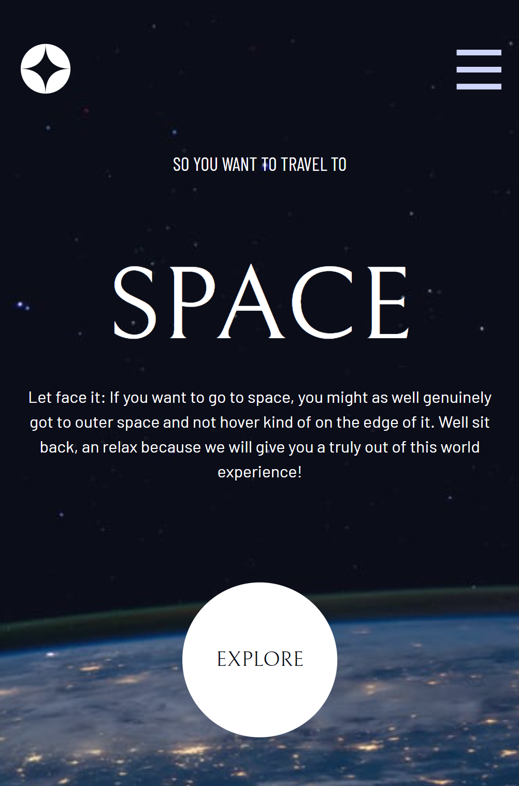

# Space-Tourism app

This is a solution to the [Space tourism website challenge on Frontend Mentor](https://www.frontendmentor.io/challenges/space-tourism-multipage-website-gRWj1URZ3).

## Table of contents

- [Overview](#overview)

  - [The challenge](#the-challenge)
  - [Screenshot](#screenshot)
  - [Link](#link)

- [My process](#my-process)
  - [Built with](#built-with)

## Overview

### The challenge

Users should be able to:

-View the optimal layout for each of the website's pages depending on their device's screen size
-See hover states for all interactive elements on the page
-View each page and be able to toggle between the tabs to see new information
-Personal challenge: add a loading screen.

### Screenshot

  

  
  

### Link

https://martinadujmusic.github.io/space-tourism/
  

## My process

### Built with

- Mobile-first workflow
- CSS custom properties
- Flexbox
- Single page application
- [React](https://react.dev/) - JS library
